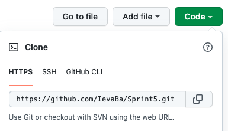

# Sprint 5 - Grocery Shopping List App using React

- Sprint 5 is a project i made while studying at BIT.
- It's a web application to help simplify and organise your shopping, get some ideas for recipes.

## About

- Project was made using React library;
- For the main styling i used Bootstrap CSS framework, which was installed through terminal with a command line `npm install react-bootstrap bootstrap@5.1.3`;
- Project navigation consists of 3 pages (Home, Shopping List and Recipes), for which i had to install react router: `npm install react-router-dom`;
- For icons to appear, the command `npm install react-icons --save` was necessary.

## Features

- Shopping list consists of the following features:
  - Add new item
  - Mark item as completed
  - Edit item
  - Delete one item or all at once;
- Implemented local storage.

## Launch procedure

This project is live via Github Pages - [Grocery shopping List App](https://ievaba.github.io/Sprint5/)

Though to open it localy, follow the steps below:

1. Navigate to the folder where you want to have this project saved.
2. Clone my Github repository [Sprint5](https://github.com/IevaBa/Sprint5)

3. Open your terminal, type `git clone` , paste the URL you copied and press Enter to create your local clone.
4. Open cloned project in VScode.
5. To see the application in browser you still need node_modules and other ignored files. Run `npm install` in terminal to get that.
6. One final thing - run `npm start` and Enjoy !!!

**Note**: if you see this warning in console: `a **WARNING** in ./node_modules/bootstrap/dist/css/bootstrap.min.css (./node_modules/css-loader/dist/cjs.js??ruleSet[1].rules[1].oneOf[5].use[1]!./node_modules/postcss-loader/dist/cjs.js??ruleSet[1].rules[1].oneOf[5].use[2]!./node_modules/source-map-loader/dist/cjs.js!./node_modules/bootstrap/dist/css/bootstrap.min.css) Module Warning (from ./node_modules/postcss-loader/dist/cjs.js): **Warning** (6:29521) autoprefixer: Replace color-adjust to print-color-adjust. The color-adjust shorthand is currently deprecated. Search for the keywords to learn more about each warning.`

Navigate to: node_modules=>bootstrap=>dist=>css=>bootstrap.min.css and change color-adjust to **print-color-adjust**;

## Author

This project was fully created by me - Ieva Baltriukaite.

Find me on [LinkedIn](https://www.linkedin.com/in/ieva-baltriukaite-59038755/)
